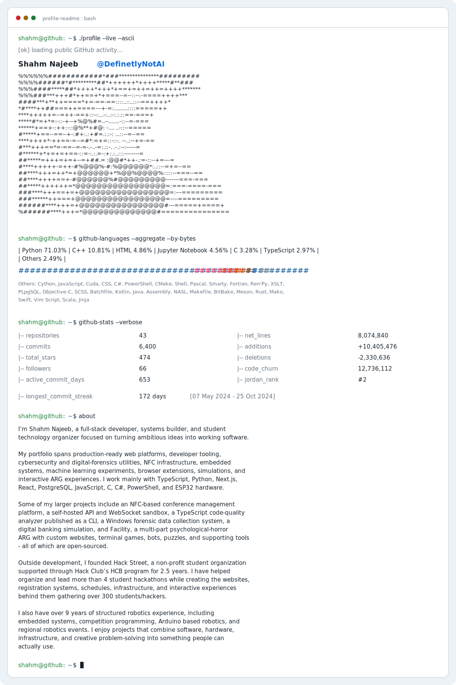

<picture>
    <source media="(prefers-color-scheme: dark)" srcset="./dark_mode.svg">
    
</picture>

---

    

 

<table align="center">
    <tr>
        <th align="center">Frameworks</th>
        <th align="center">Tools &amp; Platforms</th>
    </tr>
    <tr>
        <td align="center">
            
            
            
            
            
            
            
            
            
            
            
            
            
            
            
            
            
        </td>
        <td align="center">
            
            
            
            
            
            
            
            
            
            
            
            
            
            
            
        </td>
    </tr>
</table>

---
